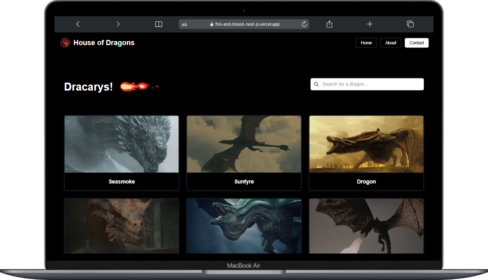
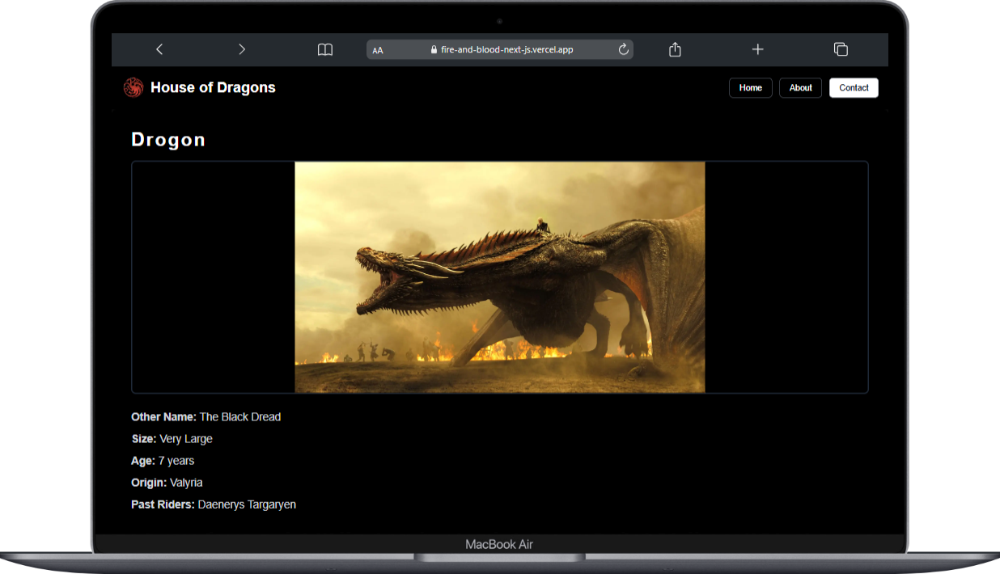
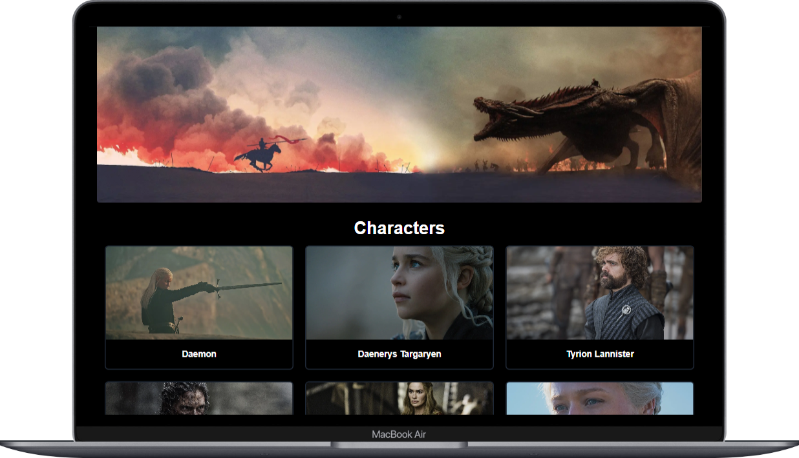
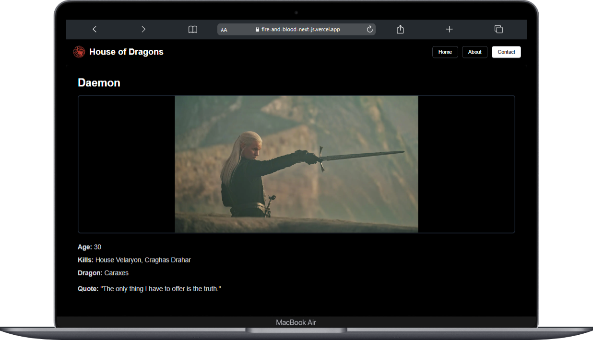

# FireAndBloodNextJS

## Overview

FireAndBloodNextJS is a Next.js website dedicated to showcasing dragons and characters from the House of the Dragon series. Users can explore detailed information, including the size, age, origins, and past riders of dragons, as well as character statistics and quotes. The platform also features a search functionality to easily find specific dragons or characters.

## Features

- **Dragon Information**: View detailed descriptions of various dragons, including size, age, and origin.
- **Character Profiles**: Explore character details, including age and notable actions.
- **Search Functionality**: Quickly search for specific dragons or characters to find the information you need.

## Technology Stack

- **Frontend**: Next.js
- **Styling**: Tailwind CSS

## Installation and Setup

1. Clone the repository:

   ```bash
   git clone https://github.com/usamafayaz/fire-and-blood-nextjs.git
   ```

2. Navigate to the project directory:

   ```bash
   cd fire-and-blood-nextjs
   ```

3. Install the dependencies:

   ```bash
   npm install
   ```

4. Run the development server:

   ```bash
   npm run dev
   ```

5. Open your browser and visit `http://localhost:3000` to view the website.

## Live Demo

You can see its demo; it is deployed at this link:
https://fire-and-blood-next-js.vercel.app/

## Contact

For any inquiries or support, please contact [usama.fayyaz157@gmail.com].


<br>  

<br>

<br>  

